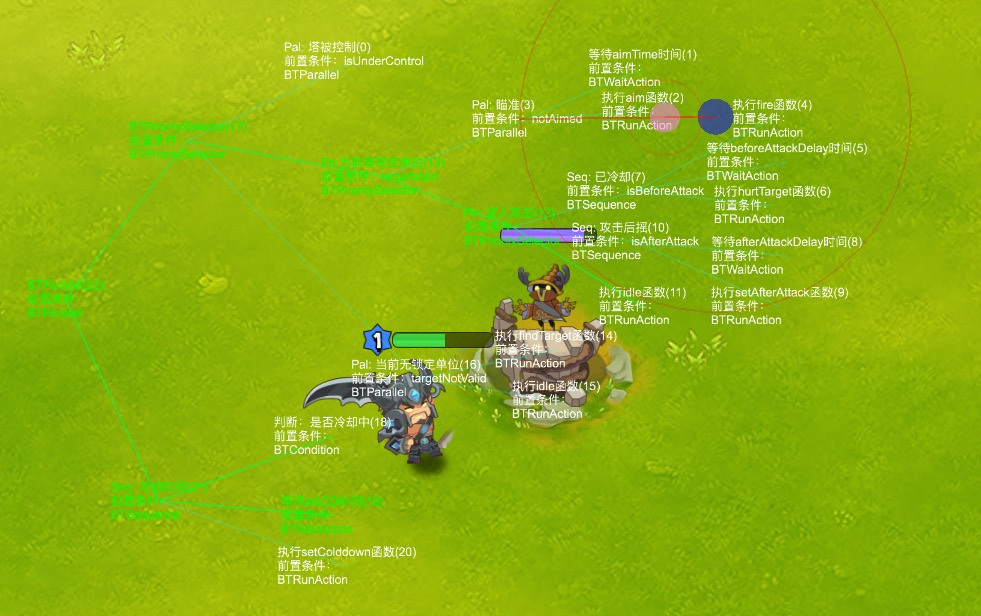
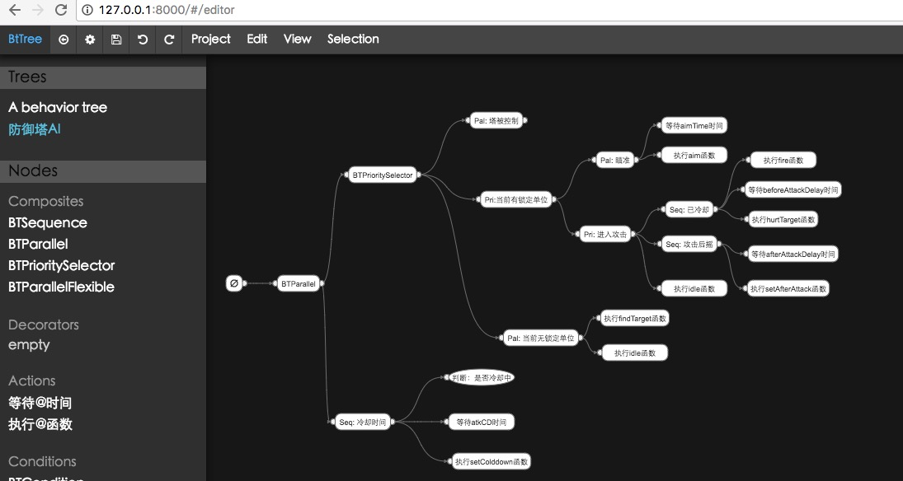

# BtTree
A behaviour tree framework with editor.

## Features:
* simple
* fast
* extendable
* visual-editing
* visual-debuggable
* platform-independent

## Support Languages:
* Lua
* to be continued...

## Usage:
* edit behaviour scripts(json) with editor
* see: lua/src/test.lua as a demo

## Roadmap:
* more composite nodes, such as RandomSelector...
* more decorators and editor support.
* other languages support, maybe python or java first...
* add debug&release feature for editor, i.e., remove debug infomations from json output files.

enjoy it, any suggestion will be appreciated. you can contact me via email: 49392515@qq.com
